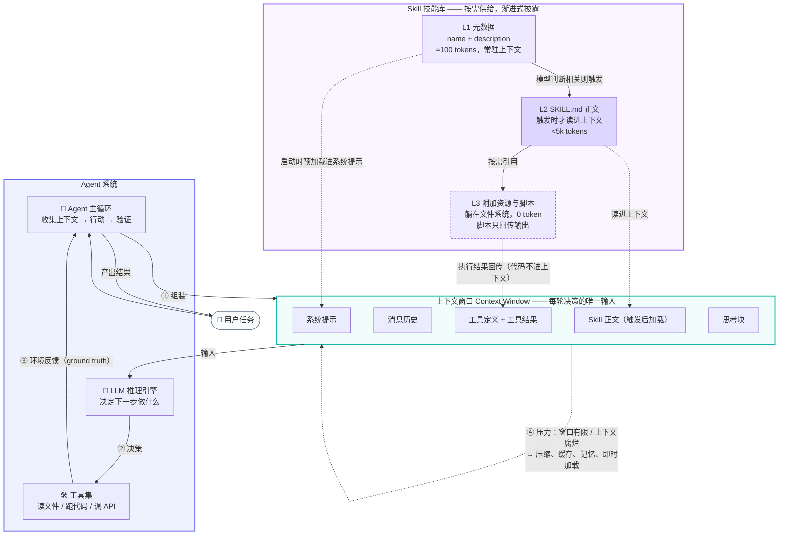

# Agent、上下文、Skill 三者关系说明

> 配套学习资料：`learning-materials/agent.html`、`learning-materials/llm-context.html`、`learning-materials/skill.html`

---

## 一、先看结论：一个比喻

把这三者放到同一家公司里看，关系会非常清楚：

| 概念 | 公司里的角色 | 回答的问题 |
| --- | --- | --- |
| **Agent（智能体）** | 员工本人 | **谁在干活？怎么干活？** |
| **上下文（Context）** | 员工此刻桌上摊开的资料 | **他现在眼前有什么？** |
| **Skill（技能）** | 公司沉淀的岗位手册 / 工具柜 | **他凭什么干得专业？** |

关键洞察是：**上下文是 Agent 每一轮决策的唯一输入，而 Skill 是上下文的一种高效供给方式。**

Skill 不是 Agent 之外的第四个东西，它就是「如何更聪明地往上下文里放东西」这个问题的答案。

---

## 二、三者关系图

---

## 三、三组两两关系

### 1. Agent ↔ 上下文：循环与燃料

Agent 的每一次决策，都只能基于当前上下文窗口里的内容——**上下文之外，模型一无所知**。这决定了：

- Agent 的能力上限，很大程度上等于「你能给它喂进多好的上下文」。
- 主循环的第一件事就是**收集上下文**（gather context），而不是直接行动。
- 但上下文会腐烂：token 越多，模型准确召回信息的能力越低。Agent 跑得越久，这个问题越严重。

所以 Agent 的设计，本质上是一场**与上下文窗口的持续博弈**：多轮循环带来更强的能力，也带来更快的上下文膨胀。

**应对手段（四选多，解决不同失效模式）：**

| 手段 | 解决的失效模式 |
| --- | --- |
| 即时上下文（JIT） | 窗口占用 —— 不预先加载，用时再取 |
| 压缩（Compaction） | 长会话撑爆窗口 —— 摘要历史，但有损 |
| 提示缓存（Caching） | 成本与延迟 —— 稳定前缀跨调用复用 |
| 记忆工具（Memory） | 无状态性 —— 关键信息落盘，跨会话存活 |
| 子智能体（Subagent） | 污染主上下文 —— 隔离窗口，只回传结论 |

---

### 2. Skill ↔ 上下文：按需供给，而非全量堆砌

Skill 存在的直接理由，是**解决上下文的两难**：

> 你想让 Agent 懂很多专业流程，但把这些流程全写进系统提示，会立刻烧光注意力预算。

渐进式披露（Progressive Disclosure）给出的答案是——**打包进文件系统，用时才取**：

- **L1 元数据**：启动时全部预加载，每个仅约 100 token。装 50 个 Skill 也只占 5k token，模型却「知道」自己有 50 种能力可用。
- **L2 正文**：只有模型判断相关时才读取完整 `SKILL.md`。
- **L3 资源**：附属文件与脚本躺在磁盘上，**不读就不消耗任何 token**；脚本执行时代码不进上下文，只有输出回传。

结果：**Skill 可捆绑的内容量实际上没有上限，而未使用的部分对上下文零惩罚。**

这直接呼应了上下文工程的核心主张——「最小的高信号 token 集合」。Skill 是这一主张的最佳工程实践之一。

---

### 3. Agent ↔ Skill：通用能力与专业知识的分离

没有 Skill 的 Agent 是「通才」：什么都能聊，但不懂你公司的具体规矩。Skill 把它变成「专才」——而且**不需要重新训练、不需要为每个用例造专用 Agent**。

- **可组合（Composable）**：多个 Skill 叠加，模型自动协调使用。
- **可移植（Portable）**：统一格式，一处编写多处使用。
- **可积累**：团队把踩过的坑写进 Skill，就变成了组织资产。本仓库的 `concept-generator` 正是如此——它把「概念学习资料该怎么写」固化成了可复用模板，本次作业的三份 HTML 就是它的产物。

一句话：**Agent 提供「会干活」的通用能力，Skill 提供「干得对」的专业知识。**

---

## 四、串成一条完整链路

以「用户让 Agent 生成一份概念学习资料」为例（即本次作业的真实过程）：

1. **启动**：Agent 加载所有 Skill 的 **L1 元数据**进系统提示 —— 它知道有个 `concept-generator`，但还没读正文。
2. **收到任务**：用户要求生成 Agent / 上下文 / Skill 三份学习资料。
3. **匹配触发**：模型判断 `concept-generator` 相关，读取 **L2 `SKILL.md` 正文** —— 六段式结构与 Tailwind 样式要求进入**上下文**。
4. **执行循环**：Agent 按指令生成 HTML；联网**核实参考链接**（避免编造网址）；把结果**写入文件系统**（而非一直堆在上下文里）。
5. **上下文管理**：长任务中通过写文件、压缩等手段，避免中间过程把窗口撑爆。
6. **交付**：产出 `learning-materials/*.html`，**原始素材没有长期占用上下文**。

三个概念在这一条链路里各司其职：**Agent 驱动循环，上下文承载每一轮的输入，Skill 决定往上下文里放什么、怎么放。**

---

## 五、易错点速查

| 易错说法 | 正确认识 |
| --- | --- |
| 「Skill 是 Agent 的一种」 | 不是。Skill 是**知识资产**（文件夹），Agent 是**执行主体**（循环）。 |
| 「上下文就是聊天记录」 | 不是。还包括系统提示、工具定义与结果、附件、技能、思考块等全部输入 token。 |
| 「Skill 会占满上下文」 | 不会。未读取的文件 0 token，L1 元数据每个才约 100 token。 |
| 「上下文窗口越大越好」 | 不是。上下文腐烂始终存在，裁剪比扩容更有效。 |
| 「Skill 能替代 MCP」 | 不能。MCP 管**连接**（能碰到什么），Skill 管**方法**（该怎么干），二者互补。 |
| 「多轮调用工具的都是 Agent」 | 不一定。控制流写死的是 Workflow；模型能改变控制流的才是 Agent。 |

---

## 六、自测

1. 为什么「装 100 个 Skill」不会拖垮一个 Agent？请结合渐进式披露说明。
2. Agent 长任务跑到后期开始偏离最初目标，从上下文角度该如何诊断与解决？
3. 判断：某系统把所有业务规则硬编码进系统提示，导致上下文臃肿、命中率低。改用 Skill 能带来哪三点改善？

参考要点

1. L1 元数据每个仅约 100 token，100 个约 1 万 token 即可常驻；正文与资源按需加载，未使用则 0 token。瓶颈只在 `description` 的匹配质量，不在容量。
2. 诊断：上下文腐烂 + 早期信息被压缩丢失。解决：关键信息先落盘到记忆/文件系统 → 再做压缩 → 探索性子任务拆到 Subagent 隔离窗口 → 稳定前缀用缓存降本。
3. ① 常驻成本从「全量规则」降到「≈100 token 的元数据」；② 规则按需加载，不相关规则零占用；③ 规则拆分为文件后可维护、可复用、可跨项目移植（且脚本执行不占上下文）。

